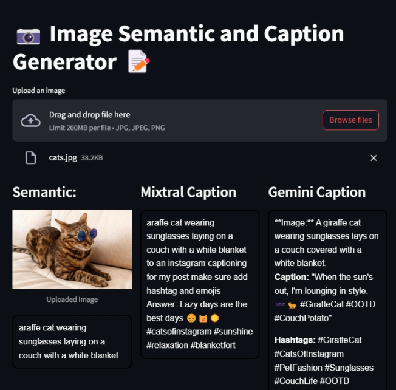

# Caption_Generator For Insta

Generate a caption for Insta Post using Hugging Face Model and Gemini API

Create Venv

```
conda create -p Caption3.11 python=3.11 -y

conda activate Caption3.11/
```

```
pip install -r requirements.txt
```

copy your authorization token form Hugging Face and Google_API_Key from their respective sites

For Image to sementic meaning(image to Text)

https://huggingface.co/Salesforce/blip-image-captioning-large

for Sementic meaning to text(Text2Text)

https://huggingface.co/mistralai/Mixtral-8x7B-Instruct-v0.1


Run Streamlit App

```
streamlit run caption_generator.py
```



